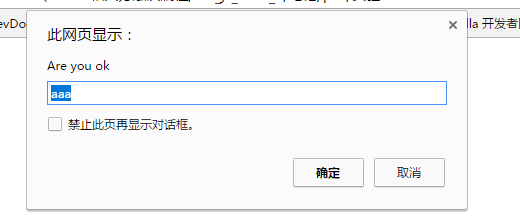

# Learn JavaScript

## 8 BOM

window对象 || location对象 || navigator对象 || screen对象 || history对象

BOM 原先没有统一的规范，由浏览器厂商按照各自的想法扩展，但是近来 W3C 将BOM的主要方面纳入了HTML5中；

### 8.1 window对象

window对象是BOM中的核心对象，它表示一个浏览器的一个实例；在浏览器中window对象具有两重身份，

1. 作为浏览器窗口的一个接口。
2. 作为ECMA指定的Global对象[注1]，这意味着在网页中定义的任何对象、变量、函数都以window作为其Global对象；

- 注1：
    1. Global 不依赖宿主环境的对象，而window对象依赖于浏览器，在浏览器环境下Global对象就是window对象；
    2. Global 对象从不直接使用，也不能创建，可以理解其不存在；

#### 8.1.1 全局作用域

1. 全局作用域算是顶层的执行环境，在这个执行环境中创建了一个 Global 对象，所以在全局作用域定义的变量、函数，都会成为 Global 对象的属性和方法，即window的属性和方法；

        ```js
            var age = '11';
            alert(window.age) //11
            function test (){
                alert(this)
            }
            age()//window
            window.age() // window;
        ```

2. 在window上定义属性和定义全局变量还是有一些差别的：
    全局变量不能通过delete删除，而直接在window对象定义的属性可以；（和实测不同注[1]）

        ```js
            //在ie8及以下版本，无论是如何创建，在删除window的属性时都会报错；
            var name = 'reader';
            window.age = '23';

        /*
            写成delete window.attr 和 delete attr 相同
        */

            //返回false
            delete window.name;
            //返回true
            delete window.age;

            alert(window.name) // reader
            alert(window.age)  //undefine
        ```

- 注

    1. 经测试在chrome和ff下可以删除全局作用域定义的window属性，而ie下全局变量不能通过delete删除，而直接在window对象定义的属性可以；为保证统一建议不要通过delete删除全局作用域定义的window属性；这是因为通过 var 语句添加的window属性有一个 [[Configurable]]的特性，这个特性的值被设置为false(也就是不允许删除)

    2. 尝试访问未声明的变量会报错，但是访问赋值的window对象的属性会返回undefined

#### 8.1.2 窗口关系以及框架(iframe)

这里主要介绍frameset框架--由于frameset有诸多问题不建议使用(但是使用场景还是存在的)，目前暂时跳过。

- 注：HTML5不再支持使用frame，iframe只有src 属性；
    具体可见：
    [html-ifram](http://gongxquan.blog.163.com/blog/static/2108462532012111643039216)

#### 8.1.3 window 对象常用属性和方法

1. 窗口位置：
    screenLeft || screenTop || screenX || screenY
    用于得到浏览器窗口相对于屏幕之间的距离，由于使用的范围有限，当遇到实际情况时再做了解；

2. 窗口大小
    innerWidth || innerHeight || outerWidth || outerHeight
    由于糟糕的兼容性问题，这几个并不能准确得到浏览器距离屏幕在各个方向上的距离，而得到页面视口的尺寸通过 clientWidth 和 clientHeight 获取更为合适当遇到，最好滚局实际情况再做决定；

        ```js
            window.innerWidth -- 窗口的宽度
            window.innerHeight -- 窗口的高度
            // 会将滚动条的尺寸计算在内
        ```

    - 注: IE8及以下不支持，如果考虑兼用的情况建议在标准浏览器中使用    `document.documentElement.clientWidth` && `document.documnetElment.clientHeight` 来获取视口尺寸

3. 滚动条尺寸
    `pageXOffset`/`pageYOffset` `scrollY`/`scrollX`

        ```js
            window.pageXOffset -- 横向滚动条的滚动位置
            window.pageYOffset -- 纵向滚动条的滚动位置
        ```
    - 注：
        1. pageXOffset && pageYOffset IE8及以下不支持；
        2. 在移动端中通过window.scrollY || window.scrollX 来获取滚动条滚动距离

4. 导航和打开窗口 - open() || close()
    `window.open`

    - 接受四个参数：
        1. 要加载的url
        2. 窗口目标 ||\_self ||\_blank || \_top || \_parent || \_topFrame
        3. 一个特殊的字符串 --- 表示一个由逗号分隔的设置字符串，表示在新窗口中都显示那些特性
        4. 一个表示新页面是否取代浏览器历史记录中，当前加载页面的布尔值

    - 实例：

            ```js
                //----- open ---------
                            // 功能：
                            // 打开空白页：
                            open();
                            //打开指定链接
                            open('http://www.baidu.com');
                            //在当前页面打开指定链接(默认是_blank;)
                            open('http://www.baidu.com','_self');

                            //返回值：
                            //返回新开页面的window对象,并且在不跨域的情况下可以对其进行修改；
                            opener = window.open();
                //          alert(opener) // object window
                //          alert(opener == window) // false

                            opener.document.documentElement.style.backgroundColor = "fb3";
            ```

    - 注：
        1. 由于安全限制，许多浏览器都禁止了一部分设置的功能，所以一般只设置第一个参数和第二个参数；(在本地打开的页面可能会解除部分限制)
        2. 弹出窗口的window中具有一个opener属性，指向将它弹出的window；但是父级window没有能指向自己winodw的属性；
        3. 如果新开的窗口与父级窗口之间有通讯，那么新标签就不能独立运行；
        4. 如果将opener属性设置为null就可以切断其与父级window的联系；并将自己放入单独线程中；
        5. 弹出窗口屏蔽程序：
            如果要弹出的窗口被屏蔽，window.open()将会返回null，并报错。
            如果想要返回null并且阻止报错要使用try catch
        6. 可以通过调用方法： close() 去关闭当前页面；

5. 间歇调用和超时调用

    - setTimeout() || clearTimeout(); 延时定时器

        setTimeout()是window对象的一个方法；--意味着超时调用都是在寻找到window后执行的。在非严格模式下this指向window，严格模式下undefined；

        第一个参数可以是字符串--和eval()相同的原理，但是损伤性能；也可以是函数，在window调用setTimeout前会先浏览函数，如果函数是执行的就立刻执行,然后结束。

            ```js
                var btn = document.querySelector('input');
                btn.onclick = function () {
                    setTimeout(alert(this),1000) //btn
                    setTimeout(function () {
                        alert(this) // window
                    }, 2000)
                }
            ```
        调用setTimeout()后，返回的是一个数值的ID,通过clearTimeout(ID)可以提前取消调用；

    - setInterval() || clearInterval() 超时定时器
        和setTimeout基本一致,不多叙述
    - 总结：
        一般认为，使用超时调用模拟间歇调用是一种最佳模式，因为后一个间歇调用可能在前一个间歇调用之前调用，而超时调用只有在执行队列为空的时候才会将下一个调用放入执行队列；

6. 系统对话框

    alert() || confirm() || prompt

        ```js
            confirm('Are you ok?'), // ok 返回true cancel返回false
            prompt('Are you ok', 'aaa') //返回文本中输入的内容，如果选择关闭对话框则返回null,'aaa'可以不写
        ```

    
    

    - 注：
        1. 首先系统对话框是浏览器设置，不接受更改，所以一般使用情况有限；
        2. 属于弹窗，可能会被屏蔽；

7. 与 window 相关的事件

    onfocus || onblur || onscroll || onresize || onhashchange

    - 注:
        1. 通过名字就知道干什么，所以不做结束
        2. onscroll || onresize 这里的两个事件的触发原理是通过判断在一段时间结束时前后值只要发生变化就执行一次，如果在这段时间内，不断的变化位置或者尺寸也只是执行一次；
        3. 在使用定时器中，当当前窗口失去焦点的时候，浏览器会将该定时器放慢，获取焦点的时候在回复，这回导致一些错误，所以要在window.onblur的时候停止定时器，然后window.onfocus的时候重新开启

8. 其余方法

    scrollTo()
    - 语法
        `window.scrollTo(xpos,ypos)`
    scrollTo() 方法可把内容滚动到指定的坐标。
    全兼容--并且元素都可以调用

### 8.4 location 对象

location对象是最有用的BOM对象之一，它提供了与当前窗口中加载的文档相关的信息；

location对象是一个特殊的对象，它即是window的属性，又是document的属性，使用`window.location` 和 `document.location` 引用的是同一个对象；

#### 8.4.1 location 对象的属性

location对象提供了当前文档的信息，还将URL解析为独立片段，存入其相应属性；

- location对象属性列表：
    1. hash -- 返回URL中的hash（#号以后），如果没有就返回空字符串；可以配合onhashchange使用(可读可写)
    2. host -- 返回服务器名称和端口号
    3. hostname -- 返回服务器名称
    4. href -- 返回完整的URL，使用location对象的toString()返回同样的值(可读可写)
    5. pathname -- 返回URL中的目录和文件名
    6. port -- 返回URL中指定的端口号
    7. protocol -- 返回页面的使用协议
    8. search -- 返回URL的查询字符串（?及以后的字符串）(只读)

1. search -- 查询字符串参数
    虽然通过search可以获得?以后的字符串(包含?),但是如果想要取得细节还要进一步的分解：

        ```js
            /*
                用于解析查询字符串，返回一个包含所有参数的对象；
            */

            function getQueryStringArgs() {
                // 如果存在查询字符串，就去除?,如果没有就为空；
                var qs = (location.search.length > 0 ? location.search.substring(1) : '' ),
                // 声明一个空的对象，等待存储数据；
                args = {},
                // 将处理好的查询字符串以'&'分割
                items = qs.length ? qs.split('&') : [],
                // 用于存放名称和值
                item = null,
                // 用于接受名称
                name = null,
                // 用于接受值
                value = null,
                i = 0,
                len = items.length;
                // 将数据加载到args对象中;
                for (var i = 0; i < len; i++) {
                    item = items[i].split('=');
                    name = decodeURIComponent(item[0]);
                    value = decodeURIComponent(item[1]);

                    if (name.length) {
                        args[name] = value;
                    }
                }
                return args;
            }
        ```

#### 8.4.2 location 对象相关方法

assign || replace || reload

1. assign()
    使用location.assign()并向其传递一个URL就会立即打开一个页面;
    `location.assign('https://www.baidu.com/?tn=monline_3_dg')`

    通过修改location下的href 或者 直接修改window的location属性，都能实现调用assign()从而实现跳转，其中最常使用的是location.href
    当读到这一段代码时立即跳转到指定地址；

        ```js
            setTimeout (function(){
                location.href = 'https://www.baidu.com/?tn=monline_3_dg';
                },1000)
        ```
    - 注:
        这些跳转方法都会产生历史记录，可以通过返回按钮，返回上一个页面，如果是立即跳转在chrome下也会禁止掉返回按键

2. replace()
    通过replace可以实现跳转
    `location.replace('https://www.baidu.com/?tn=monline_3_dg');`
    通过replace()跳转不会产生历史记录，不能通过返回键，返回上一个页面

3. reload()
    `location.reload()`会从缓存中重新加载页面，如果传入true，则会强制从服务器上重新加载页面；

### 8.5 navigator对象 -- navigator 直译导航器

navigator是检测客户端浏览器的标准；
常用的是 window.navigator.userAgent
内容过多 不一一记录，需要时查询

### 8.6 screen对象

screen对象下有很多属性，真正有用的不多；
这里只记录两个当有需要时再查询添加；screen.width || screen.height
这里得到的是整个屏幕的像素尺寸不带单位；

### 8.7 history 对象

history对象中保存着用户的上网记录，每当URL变化的时候就会产生一条历史信息，由于安全问题，不能由开发人员直接操作URL，而是通过用户访问过的页面列表实现跳转；

- 方法：
    1. go();
        `history.go()`可以在历史记录中任意跳转；
        - 参数：
            整数值，负数表示向后跳转 或者 字符串 浏览器会在历史记录中检索字符串，然后跳转到距离当前最近的页面；如果查找不到就什么也不干；
    2. back();
    3. forward();

- 属性：
    length;
    记录当前窗口下的所有历史记录的长度
    一个窗口打开第一个页面的时候length=1；
    可以通过该方法检测当前页面是不是当前窗口打开的第一个页面

        ```js
            if(histroy.length == 1){
                alert(这是用户打开的第一个页面)
            }
        ```