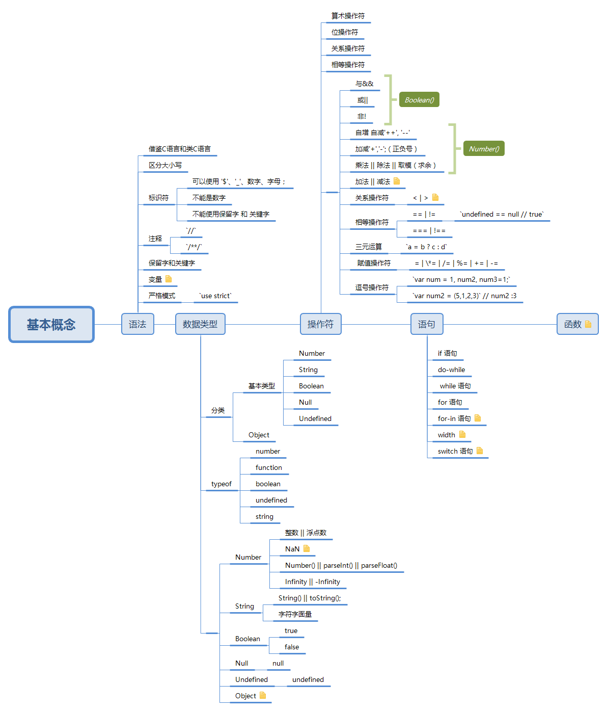

# Learn JavaScript

## 3. 基本概念

`语法 || 语句 || 保留字和关键字 || 变量 || 数据类型 || 流控制语句 || 函数`
- JavaScript 中的规范，遵从于 ECMAScript；目前各大主流浏览器都已经实现了 E5；



### 3.1 语法

ECMAScript 语法大量借用了C 语言以及类C语言（Java 和 Perl）的语法;

- 区分大小写
在 ECMAScript 中的一切，都区分大小写

- 标识符
标识符 -- 变量、函数、属性以及函数参数；
标识符要符合一些要求：
 1. 可以使用 '$'、'\_'、数字、字母；
 2. 首字符不能是数字；
 3. 不能使用保留字 和 关键字

> 建议：一般来说，标识符采用驼峰式命名

- 注释
ECMAScript 使用两种注释方式
 1. 单行注释： `//`
 2. 多行注释： `/**/`

- 严格模式
在 js 文件顶部或者函数内部的顶部输入 `use strict`; 就告诉了 js 引擎使用严格模式

### 3.2 语句

在 ECMAScript 中规定，语句以分号结尾，如果没有分号则由解析器确定语句的结尾

但是省略分号有风险：
1. 在压缩代码的时候，可以会出现错误
2. 省略分号，有损性能

### 3.3 保留字和关键字

ECMAScript 中规定了保留字 和 关键字
保留字 --- 可以会成为关键字；
关键字 --- 用于执行某些特定操作

（不细说，如有需要可以查书）

### 3.4 变量

js 是弱类型语言，在 ECMAScript 中的变量可以存放任何类型的数据；
声明方式： `var name = value`

>注：
1. 如果不写 `var` 去声明一个变量，那么这个变量就是全局变量,但是这种方式不易于维护
2. 通过 `var` 声明的变量是当前作用域的局部变量，
3. 如果没有声明 `value` 则是存放 `undefined`
4. 建议在声明变量以后就不要改变变量的数据类型

### 3.5 数据类型

在 ECMAScript 中规定了5中基本类型和一个复杂类型；
基本类型：Undefined、 Null、 Boolean、 String、 Number
复杂类型：Object

1. typeof 操作符
typeof ---- 一元操作符，用于检测变量类型
语法：`typeof 变量名`
返回：`undefined || boolean || number || function || string || object`

 >注： typeof null 返回 object;

#### 3.4.1 Undefined 类型

Undefined 类型 -- `undefined`

- Undefined 类型 只有一个值 `undefined`, 当一个变量声明了，但是没有初始化的时候，那么这个变量的值就是 `undefined`;

#### 3.4.2 Null 类型

Null 类型 -- null

- Null 类型只有一个值 'null', Null 代表一个空的指针， 所以typeof null 返回 object
- 建议在定义一个变量，而且这个变量在将来会接受一个对象类型的值的时候，最好显示的将其声明成null；
- 为 null 的变量会被垃圾回收机制回收；

#### 3.4.3 Boolean 类型

Boolean类型 -- `false || true`

- 使用 `Boolean()` 可以将所有类型的值转换成一个 Boolean 值
可以转换成false的有：`null、 0、 false、 空字符串、 NaN`

#### 3.4.5 Number 类型

Number -- 整数 || 浮点数

- 字面量格式：
10进制：`var num = 10`;
8进制： `var num = 071`;
16进制：`var num = 0xA`;
注：转换失败或者在计算中都会成为10进制

- 浮点数 -- 小数：
当出现6个零的时候，就会使用e来表示
比如：`0.00000001 => 1e-7`; `10000000 => 1e7`

 >注：浮点数计算存在精度问题 所以不要使用浮点数计算作为判断条件

- 数值范围
 Infinity || -Infinity

- NaN
NaN --- Not a Number
用于表示一个没有存放数值的数字类型变量, 常出现在计算失败的时候；

 特点：
 1. 关于NaN的任何操作，都将返回NaN
 2. NaN 不等于 NaN

 isNaN () 用于判断一个变量是否能够使用Number()转成数字类型,能就是false 不能 就是true
>例如：
isNaN(true) // false true => 1
isNaN(false) // false false => 0
isNaN('10') // false '10' => 10
isNaN('string') // true
isNaN('') // false
isNaN(null) // false null => 0

- 数值转换(强制类型转换)

 Number() || parseInt() || parseFloat()
 1. Number() -- 将一个值转换成一个数组类型
将输入的值，看成一个整体进行转换，如果失败返回NaN
>其中；
true => 1
false => 0
'' => 10
null => 0

 2. parseInt() -- 将一个值转换成一个整数
首先从第一个不为空的字符开始，到第一个不为数字的字符或者结束位置为止；
如果不能转换就会返回一个NaN
可以接受第二个参数：规定解析的格式（进制）
>注：如果没有第二个参数，会由parseInt来决定如何解析这个字符串，这是不安全的所以建议任何情况下都明确解析的方式
例：`parseInt(string, 10)`

#### 3.4.6 字符串类型
字符串由单引号或者双引号包裹，建议统一使用单引号

- 字符字面量
在String中存在一些转译序列
`\n` -- 换行； `\t` -- 制表符（Tab） `\b` -- 退格； `\r` -- 回车； `\\` -- 斜杠； `\'` -- 单引号；`\"` -- 双引号

- 字符串特点
ECMAScript 中规定，字符串一但创建了就不可变，如果要改变某个字符串变量中保存的字符串，首先会销毁原来的字符串，然后用一个包裹新值的字符串填充

- 转换成字符串：
String() || toString();
除null和undefined以为都有toString()方法，将其转化成字符串，所以的数据类型都可以使用String()转化
>注：null => 'null' ; undefined => 'undefined'; 其余会调用toString方法转换

#### 3.4.6 Object类型
在ECMAScript中，所有的对象都是继承于 Object 对象；

- 创建一个Object对象：
`var obj = new Object()`
如果不传参数可以省略`()`;

- Object 下有下列方法和属性：
 1. constructor -- 当前实例的构造函数
 2. hasOwnProperty(prototypeName:string) -- 用于判断传入的属性名，是否存在当前实例的原型链上
 3. isPortotypeOf(object) -- 用于检测对象是不是存在传入对象的原型链上
 4. toString() -- 返回对象的字符串表示
 5. valueOf() -- 返回对象的字符串、数值、布尔值表示，一般和toString()返回的相同
.........

### 3.5 操作符

ECMA - 262 中规定了：`算术操作符、位操作符、关系操作符、相等操作符`
这些操作符可以应用于各种数据类型，不过在应用于对象的使用会先调用`toSting() || valueOf()`方法取得可以操作的值；

#### 3.5.1 一元操作符

`++ || -- || + || -`

[DOME1](././html/example.js)
只操作一个值的操作符叫做一元操作符

- 自增 自减
前置：'++', '--' 先自增/自减然后再操作
后置：'++', '--' 先操作在自增/自减
以自减为例：
```
var num = 10;
console.log(num--); // 10
console.log(num); // 9
var num1 = 10;
console.log(--num1); // 9
```
如果运用在非数字的变量中，
可以看做__先调用了Number()的方法__，然后在执行（这是一个大致情况）；
如果遇到的是浮点数，则是加减1的操作

- 一元加减操作符
`'+','-';`
__看起来就显示正负号，但是会调用 Number() 方法去转换；__
```
var a = '12';
console.log(+a); // 12
console.log(typeof(+a)); // number
```
>注：这种一元加减的操作符可以用于隐式类型转换

- 位操作符
这里改变的是变量在计算机内部储存的2进制编码，不做了解，如有需要看书，但是由于是直接操作2机制编码性能是杠杠的

#### 3.5.3 布尔操作符

`与&&、 或||、 非!`
原理：先调用Boolean() 方法转换后再操作；
>注意：
&&：如果第一项为假，就不会执行第二项；
||：如果第一项为真，就不会执行第二项；

#### 3.5.4 乘性操作符

`乘法 || 除法 || 取模（求余）`

如果遇到一个操作符不是数值，则会__内部调用 Number()__ 进行转换

#### 3.5.5 加性操作符
`加法 || 减法`

>需要注意的有：
加法：
1. 如果两侧都是字符串，就执行字符串链接；
2. 如果两侧中只有一侧是字符串，那么就将另一个转成字符串后链接
3. 如果有一侧是对象就执行toString()，后再执行加法
4. 如果是undefined 或者 null 就执行 String()后再执行

>减法：
1. 如果有一侧是对象就执行valueof(),如果没有valueof的方法就执行toString()，后再执行加法

#### 3.5.6 关系操作符

`< || >`

> 需要注意的是：
1. 如果两侧都是数字就比较数字大小；
2. 如果两侧都是字符串就比较两个字符串对象的字符编码（一位位的比较，一旦有了结果就返回）
3. 如果一个是数字，就将另一侧转换成数字后比较，转换失败就是NaN，而NaN无论如何比较 都是false
4. 如果一侧是对象，就调用valueof 没有就调用 toString
5. 如果是布尔值就转换成数字再比较

#### 3.5.7 相等操作符

`== | !=`

这里值得注意的是：
`undefined == null // true`

使用valueof 转对象，
一侧是数组，就对另一侧使用Number()

`=== | !==`

这里会先进行类型比较，然后在进行数值比较

#### 3.5.8 条件操作符

三元运算

`a = b ? c : d`

### 3.5.9 赋值操作符

常用的有：
`= | \*= | /= | %= | += | -=`

>例：
`a %= b` 就是 `a = a%b`

#### 3.5.10 逗号操作符

1. 逗号可以在一条语句中执行多个操作
`var num = 1, num2, num3=1;`
2. 逗号在赋值中，会返回表达式中的最后一个值
`var num2 = (5,1,2,3)`
这里的num2 就会是3；


### 3.6 语句

#### 3.6.1 if 语句

`if (condition) {} || if (condition)` 单行语句 -------（ 建议使用代码块 ）

#### 3.6.2 do-while

先执行后判断，至少会执行一次；

```
do {
    console.log(1); // 1
} while (false)
```

#### 3.6.3 while 语句

先判断后执行

```
while (false) {
    console.log(1); // 不会执行
}
```

#### 3.6.4 for 语句

`for(var i = 0; i < 10; i++)`
需要注意的是：由于E5中不存在块级域所以for 循环中的信息都是全局域的

#### 3.6.5 for-in 语句

`for-in`是用于对对象属性的枚举

>值得注意的：
1. 由于对象属性没有顺序，所以枚举出来的顺序由浏览器来定
2. 如果迭代的对象的属性为null || undefined 就会忽视

#### 3.6.6 break 和 continue 语句

break -- 阻止循环的执行
continue -- 阻止循环的这一次执行，继续下一次执行

#### 3.6.7 with

```
with ({a: 1}) {
    var c = a;
}
console.log(c); // 1
```

with 将语句内的变量都会先被认为是一个局部变量，如果找不到就从其关联的对象 （a）上找；
但是 不建议使用

#### 3.6.8 switch 语句

```
switch (expression) {
    case expression:
            ...
        break;
    default:
}
```

>值得注意的有：
1. case 的值可以是 任意类型的变量
2. case 接受表达式 无需括号
3. switch 在比较的时候使用的是全等比较符

### 3.7 函数

```
function functionName() {
    ....
}
```
>注：
1. 如果不是自执行的函数，且没有命名的话就会报错；
```
// function () {
//
// }
// Unexpected token (
```
2. 函数默认返回值为 undefined，
3. 建议如果函数有返回值，那么就始终存在返回值，这样更利于与维护；不能在某些条件下有返回值而在另外的条件下没有；

#### 3.7.1 理解参数

在函数中参数使用过数组保存的，由arguments对象可以访问这个数组；只不过arguments是个类数组
修改arguments可以反过来修改参数；
```
function (num, num1) {
    arguments[1] = 10;
}
```
每一次执行都会修改num1，如果没有传 num1 ， num1就会是undefined
E5中函数传递都是值传递而不是引用传递；
